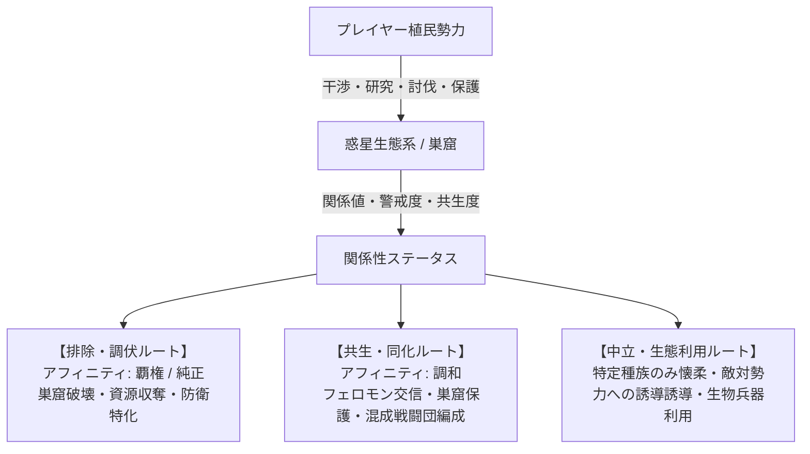

# ゲーム企画・仕様設計書：Nanai Alien Com Game (仮称)

基本的にはAI生成の文書なので注意。

## 1. ゲーム概要 & コンセプト

### 1.1 基本コンセプト

- **ジャンル**: 4X SF ターン制戦略シミュレーション（Civ / Civilization: Beyond Earth ライク）
- **テーマ**: 未知の惑星への植民、惑星生態系・原住エイリアンとの関係性構築と共存／支配／排除、勢力間競争。
- **コア体験**:
  - civbeの代替
  - 単なる「害虫駆除」ではない、**多層的かつ動的なエイリアン関係性システム**。
  - **マクロ（全体マップ）とミクロ（単一タイル個別戦術マップ）のシームレスな融合**。
  - 煩雑なスタック管理・極小ユニット操作を排除した**「固定編成・戦闘団制（増強師団相当）」**による直感的な軍事運用。
  - プレイヤーの意思決定と体験（ドラマ性）を最優先する**手動戦術戦選択制**と**豊富なダイナミックイベント**。
- **マルチスケール戦略シミュレーション**: 全体マップでの都市建設・研究・外交・部隊移動と、単一タイルマップでの小部隊戦術戦闘を統合。

---

## 2. スケールとマップシステム

本ゲームは**「全体マップ（大戦略層）」**と**「単一タイルマップ（戦術・局所運用層）」**の2重スケール構造を採用する。

```text
+-----------------------------------------------------------+
|               全体マップ (Overworld / Hex Grid)            |
|  - 都市開発・領土拡張・研究・外交・マクロ部隊移動         |
|  - 各タイルは環境特性・エイリアン巣窟・資源などを保有     |
+-----------------------------+-----------------------------+
                              |
                     [ 戦闘 / 調査 / 開発 ]
                              |
                              v
+-----------------------------------------------------------+
|             単一タイルマップ (Tactical Sub-Grid)          |
|  - 1つの全体タイル内部を展開したミクロ戦術マップ          |
|  - 戦闘団を構成する「小部隊」を配置・指揮して局所戦を展開 |
|  - 周辺タイルからの増援（戦闘団）も合流可能               |
+-----------------------------------------------------------+
```

### 2.1 全体マップ（大戦略スケール）

- ヘックスグリッドによる広域惑星マップ。
- 各タイルは地形（平原、山岳、海洋、毒性湿地、瘴気帯など）とエイリアン活性度、資源を持つ。
- 全体マップ上のユニット単位はすべて**「戦闘団（Combat Group / Task Force）」**。

### 2.2 単一タイルマップ（戦術・局所スケール）

- 全体マップの1タイル内部をさらに細分化した局所マップ。
- **突入・展開契機**:
  - 敵対勢力や野生エイリアンとの交戦時
  - 未知の遺跡・巣窟・特殊資源ポイントの深層調査
  - 特殊防衛施設や拠点の防衛戦
- **小部隊展開システム**:
  - 全体マップ上の戦闘団1個が、単一タイルマップ内では**「歩兵小隊・戦車小隊・砲兵支援班・航空支援枠」等の規定小部隊グループ**として展開される。
  - プレイヤーは小部隊レベルで遮蔽物利用、側面攻撃、スキル発動などの細かな指揮を行える。
- **周辺タイル増援ルール**:
  - 戦場となったタイルにいる戦闘団に加え、**隣接する味方戦闘団（1タイルにつき最大1個）**が増援・支援部隊として戦場に参戦可能。
  - これにより全体マップ上の布陣・陣形配置が戦術マップへダイレクトに影響を与える。

### 2.3 戦闘移行とプレイヤー体験設計（シングルプレイ重視）

- **手動戦術戦の選択権**:
  - 交戦発生時、プレイヤーは「**手動指揮（単一タイルマップで戦闘）**」か「**自動解決（全体マップ上で即座に計算）**」を自由に選択可能。
  - 手動指揮を選択した場合、地形・遮蔽・小部隊スキル・周辺増援を駆使することで、数的不利や格上相手でも覆せる**「プレイヤー有利・高体験価値」**のバランスに調整。1ターンの時間を分割するので、有限のターンでターン制限に収まるようにする。例えば包囲されたユニットが全体マップで耐えられるなら、単一タイルマップでも全体ターン終了時に損害を同程度に抑えられるよう調整。
- **マルチプレイ（将来拡張/設計思想）**:
  - 原則は双方が同意した場合のみ手動戦術戦に移行（または非同期タイマー制／自動解決メイン）。

---

## 3. 部隊・ユニット体系（戦闘団制）

煩雑なスタック管理や個別の極小ユニット生産を廃止し、すべて**「増強師団・艦隊・航空団相当の固定編成戦闘団」**として統一。

### 3.1 陸上戦闘団（Ground Combat Groups）

榴弾砲を持った自動車化軽歩兵戦闘団以上では隣接沿海域タイルへの砲撃能力あり。

### 3.1.1 通常陸上戦闘団のカテゴリー

| 種別                     | 主な役割・特徴                                                           | イメージ・構成                                                                                   |
| :----------------------- | :----------------------------------------------------------------------- | :----------------------------------------------------------------------------------------------- |
| **民間人戦闘団**         | 民間人                                                                   | 民間人、武装はないか、あっても鉄パイプ、刃物、少数では、チェーンソー、射出工具、軍用程度の猟銃   |
| **民兵戦闘団**           | 民間人を軽武装化した民兵部隊                                             | 民兵小隊                                                                                         |
| **偵察戦闘団**           | あらゆる環境での高機動力・高視界・隠蔽性。索敵に特化                     | 偵察小隊                                                                                         |
| **軽歩兵戦闘団**         | 徒歩主体の軽歩兵部隊                                                     | 歩兵小隊、対戦車歩兵小隊、軽迫撃砲小隊                                                           |
| **自動車化軽歩兵戦闘団** | 路面での機動力を持つ。牽引砲のため、展開と砲撃回避が苦手                 | 軽装甲車歩兵小隊、軽装甲車重機関銃小隊、軽装甲偵察車、牽引重迫撃砲、牽引榴弾砲、自動車化整備班   |
| **自動車化歩兵戦闘団**   | 路面での機動力と展開力に優れ、非装甲化部隊の中では最上位                 | 軽装甲車歩兵小隊、軽装甲車重機関銃小隊、軽装甲偵察車、自走重迫撃砲、自走榴弾砲、自動車化整備班   |
| **装輪装甲戦闘団**       | 装輪装甲車による部隊。路面での機動力と展開力に優れ、装甲と火力を併せ持つ | 装輪装甲火力支援車 装輪歩兵戦闘車 装輪装甲兵員輸送車、装輪装甲偵察車、自走榴弾砲、装輪装甲整備車 |
| **航空化機動戦闘団**     | ヘリコプターやVTOL機による航空機動部隊                                   | 空挺歩兵小隊、吊り下げ榴弾砲、航空整備班                                                         |
| **機甲戦闘団**           | 戦車部隊と随伴装甲車化歩兵部隊で不整地で行動可能                         | 戦車小隊、装軌歩兵戦闘車、装軌装甲偵察車、装軌装甲兵員輸送車、装甲工兵、移動整備班               |
| **ミサイル攻撃戦闘団**   | 長距離の誘導兵器による攻撃や防衛拠点への攻撃を担当                       | ミサイル発射装置車、レーダー車、運搬・装てん車                                                   |
| **調査戦闘団**           | 科学探査・遺跡解析に特化したあらゆる環境で活動可能な調査隊               | 調査科学班、護衛部隊                                                                             |

> [!NOTE]
> **歩行兵器（多脚・二脚）の扱いについて（未確定・要議論深化枠）**:
> 歩行兵器は「全地形を制覇する万能兵器」ではなく、構造の複雑さ・劣悪な燃費・高い整備負荷・軟弱地での埋没といった多くの不便さを抱えた「尖ったロマン枠・限定運用兵器」として位置づける。常備の独立戦闘団とするか、あるいは特定部隊の「工兵・悪路突破アタッチメント／特殊モジュール」として扱うかは継続して議論・検討を行う。

### 3.1.2 エイリアン戦闘団のカテゴリー

惑星固有の巨大生命体や群生生物の群れ（敵性／中立／友好）各種エイリアンが混成した群れ、様々な種類が存在する。

| 種別 | 主な特徴 | イメージ |

### 3.1.3 多種族混成戦闘団のカテゴリー

人類と同盟エイリアンを混成した戦闘団。通常戦闘団の半分の人員を同盟エイリアンに置き換えている。

| 種別                               | 主な役割・特徴                                                           | イメージ・構成                                                                                   |
| :--------------------------------- | :----------------------------------------------------------------------- | :----------------------------------------------------------------------------------------------- |
| **多種族混成偵察戦闘団**           | あらゆる環境での高機動力・高視界・隠蔽性。索敵に特化                     | 偵察小隊                                                                                         |
| **多種族混成軽歩兵戦闘団**         | 徒歩主体の軽歩兵部隊                                                     | 歩兵小隊、対戦車歩兵小隊、軽迫撃砲小隊                                                           |
| **多種族混成自動車化軽歩兵戦闘団** | 路面での機動力を持つ。牽引砲のため、展開と砲撃回避が苦手                 | 軽装甲車歩兵小隊、軽装甲車重機関銃小隊、軽装甲偵察車、牽引重迫撃砲、牽引榴弾砲、自動車化整備班   |
| **多種族混成自動車化歩兵戦闘団**   | 路面での機動力と展開力に優れ、非装甲化部隊の中では最上位                 | 軽装甲車歩兵小隊、軽装甲車重機関銃小隊、軽装甲偵察車、自走重迫撃砲、自走榴弾砲、自動車化整備班   |
| **多種族混成装輪装甲戦闘団**       | 装輪装甲車による部隊。路面での機動力と展開力に優れ、装甲と火力を併せ持つ | 装輪装甲火力支援車 装輪歩兵戦闘車 装輪装甲兵員輸送車、装輪装甲偵察車、自走榴弾砲、装輪装甲整備車 |
| **多種族混成航空化機動戦闘団**     | ヘリコプターやVTOL機による航空機動部隊                                   | 空挺歩兵小隊、吊り下げ榴弾砲、航空整備班                                                         |
| **多種族混成機甲戦闘団**           | 戦車部隊と随伴装甲車化歩兵部隊で不整地で行動可能                         | 戦車小隊、装軌歩兵戦闘車、装軌装甲偵察車、装軌装甲兵員輸送車、装甲工兵、移動整備班               |
| **多種族混成ミサイル攻撃戦闘団**   | 長距離の誘導兵器による攻撃や防衛拠点への攻撃を担当                       | ミサイル発射装置車、レーダー車、運搬・装てん車                                                   |
| **多種族混成調査戦闘団**           | 科学探査・遺跡解析に特化したあらゆる環境で活動可能な調査隊               | 調査科学班、護衛部隊                                                                             |

### 3.1.4 融合生物戦闘団のカテゴリー

人類と同盟エイリアンが生み出した融合生物の戦闘団。

// todo

| 種別                         | 主な役割・特徴                                                           | イメージ・構成                                                                                   |
| :--------------------------- | :----------------------------------------------------------------------- | :----------------------------------------------------------------------------------------------- |
| **融合偵察戦闘団**           | あらゆる環境での高機動力・高視界・隠蔽性。索敵に特化                     | 偵察小隊                                                                                         |
| **融合軽歩兵戦闘団**         | 徒歩主体の軽歩兵部隊                                                     | 歩兵小隊、対戦車歩兵小隊、軽迫撃砲小隊                                                           |
| **融合自動車化軽歩兵戦闘団** | 路面での機動力を持つ。牽引砲のため、展開と砲撃回避が苦手                 | 軽装甲車歩兵小隊、軽装甲車重機関銃小隊、軽装甲偵察車、牽引重迫撃砲、牽引榴弾砲、自動車化整備班   |
| **融合自動車化歩兵戦闘団**   | 路面での機動力と展開力に優れ、非装甲化部隊の中では最上位                 | 軽装甲車歩兵小隊、軽装甲車重機関銃小隊、軽装甲偵察車、自走重迫撃砲、自走榴弾砲、自動車化整備班   |
| **融合装輪装甲戦闘団**       | 装輪装甲車による部隊。路面での機動力と展開力に優れ、装甲と火力を併せ持つ | 装輪装甲火力支援車 装輪歩兵戦闘車 装輪装甲兵員輸送車、装輪装甲偵察車、自走榴弾砲、装輪装甲整備車 |
| **融合航空化機動戦闘団**     | ヘリコプターやVTOL機による航空機動部隊                                   | 空挺歩兵小隊、吊り下げ榴弾砲、航空整備班                                                         |
| **融合機甲戦闘団**           | 戦車部隊と随伴装甲車化歩兵部隊で不整地で行動可能                         | 戦車小隊、装軌歩兵戦闘車、装軌装甲偵察車、装軌装甲兵員輸送車、装甲工兵、移動整備班               |
| **融合ミサイル攻撃戦闘団**   | 長距離の誘導兵器による攻撃や防衛拠点への攻撃を担当                       | ミサイル発射装置車、レーダー車、運搬・装てん車                                                   |
| **融合調査戦闘団**           | 科学探査・遺跡解析に特化したあらゆる環境で活動可能な調査隊               | 調査科学班、護衛部隊                                                                             |

### 3.2 海上戦闘団（Naval Fleets）

### 3.2.1 通常戦闘団

| 種別           | 主な役割・特徴                                           | 構成艦艇イメージ                                   |
| :------------- | :------------------------------------------------------- | :------------------------------------------------- |
| **民間船艦隊** | 民間船                                                   | 大型船、小型船                                     |
| **武装船艦隊** | 軽武装を施した民間船                                     | 武装大型船、武装小型船                             |
| **哨戒艦隊**   | 哨戒・領海内監視、海賊・野生海洋エイリアンへの警戒監視   | 哨戒コルベット艦、対潜哨戒ヘリ、ミサイル艇         |
| **護衛艦隊**   | 対潜・対空に優れた輸送路防衛用艦隊                       | 護衛フリゲート、汎用駆逐艦、対潜ヘリ               |
| **通常艦隊**   | 駆逐艦・巡洋艦を中心とする外洋汎用戦闘艦隊               | 防空駆逐艦、汎用駆逐艦、護衛フリゲート             |
| **戦艦艦隊**   | 超長距離艦砲射撃と重装甲を誇る決戦用艦隊。沿岸砲撃が可能 | 戦艦、防空駆逐艦、汎用駆逐艦、護衛フリゲート       |
| **航空艦隊**   | 航空拠点としての能力を持った艦隊                         | 空母、軽空母、強襲揚陸艦、艦載戦闘機隊、早期警戒機 |
| **潜水艦隊**   | 高い隠密性を持った艦隊                                   | 攻撃型原潜、巡航ミサイル潜水艦                     |

### 3.2.2 エイリアン戦闘団のカテゴリー

/_todo_/

| **野生エイリアン艦隊** | 超巨大海洋生物（リヴァイアサン級）や海棲エイリアンの群れ 群泳刺胞獣、超大型甲殻怪獣、深海共鳴種

### 3.2.3 多種族混成戦闘団のカテゴリー

| **多種族混成団** | 人類艦隊と同盟海棲エイリアンの混成艦隊 | 各種艦隊での混成 |

### 3.2.4 融合生物戦闘団のカテゴリー

| **融合生物艦隊** | 人類と同盟海棲エイリアンの融合生物の艦隊 | 各種艦隊での融合生物艦艇 |

### 3.3 航空戦闘団（Air Wings）

| 種別                             | 主な役割・特徴                                                               | 構成機体イメージ                                                           |
| :------------------------------- | :--------------------------------------------------------------------------- | :------------------------------------------------------------------------- |
| **民間航空団**                   | 惑星内高速輸送・物資空輸を担当                                               | 貨物機、旅客機                                                             |
| **武装民間航空団**               | 軽武装を施した民間航空機                                                     | 武装貨物機                                                                 |
| **輸送航空団**                   | 陸上部隊を収容でき、不整地着陸能力を持った大型輸送機による航空団             | 軍用輸送機                                                                 |
| **哨戒航空団**                   | 広域索敵・早期警戒を担当                                                     | 早期警戒機（AEW）、対潜哨戒偵察機、大型戦闘機                              |
| **護衛航空団**                   | 民間航空機の護衛を目的とした小規模な部隊                                     | 大型戦闘機                                                                 |
| **迎撃航空団**                   | 小規模拠点から道路を活用して行動する軽戦闘機隊                               | 軽戦闘機                                                                   |
| **垂直離陸航空団**               | SVTOL型戦闘機による戦闘航空団                                                | SVTOL型戦闘機                                                              |
| **戦闘航空団**                   | 制空権確保および対地攻撃を行う主力航空隊                                     | 大型戦闘機                                                                 |
| **光学・電波ステルス戦闘航空団** | 光学・電波ステルスを装備した戦闘機部隊、コストのわりに戦闘能力は通常と同程度 | 光学迷彩ステルス戦闘機                                                     |
| **爆撃航空団**                   | 爆撃機による戦略爆撃を行う航空隊                                             | 爆撃機、大型戦闘機                                                         |
| **光学・電波ステルス爆撃航空団** | 光学ステルスを装備した爆撃機と護衛機、爆撃能力は一般爆撃機よりも劣る         | 光学迷彩ステルス爆撃機、光学迷彩ステルス戦闘機                             |
| **空中戦艦航空団**               | 空中戦艦による接近戦闘を得意とする                                           | 空中戦艦、空中空母、大型戦闘機、空中防空駆逐艦、空中護衛フリゲート         |
| **空中空母航空団**               | 空中空母による航空機の運用を主目的とする。航空拠点としての能力を持つ         | 空中空母、大型戦闘機、空中防空駆逐艦、空中護衛フリゲート                   |
| **光学・電波ステルス偵察航空団** | 敵領空などへの偵察を行う部隊                                                 | 光学ステルス偵察機                                                         |
| **超大型輸送航空団**             | 複数の超大型輸送機による艦隊の輸送を行う航空団。コストは戦艦艦隊を凌駕する   | 超大型大型輸送機、空中空母、大型戦闘機、空中防空駆逐艦、空中護衛フリゲート |

| **野生エイリアン航空団** | 飛行型エイリアン（ワイバーン/スウォーム型）の群れ | 飛翔酸吐き種、大気浮遊クラゲ、超音速飛行獣 |
| **多種族航空団** | 飛行エイリアンにパイロットが搭乗・サイバネ制御する混成航空隊 | 生体サイボーグ飛行隊、胞子散布バイオファイター |

---

補足
気流観測による完全ステルス機の索敵能力、凍った目（戦闘妖精・雪風）

## 4. エイリアンとの関係性システム（Diplomacy & Ecology）

Civ:BEの単なる「怒りメーター（攻撃頻度変化）」を超え、**種族ごとの生態・文化・コミュニケーション・思想進化（アフィニティ）**と結びついた多層的な関係性を構築。

多種族混成部隊の編成には必要なエイリアン種族を取り込む必要がある。これは兵種ごとに必要なエイリアン種が異なるだけでなく、各兵種ごとに必要なエイリアン種が事前に設定されているため、多種族混成部隊は後半程度まで時間がかかる。特に潜水エイリアンと航空エイリアンは取り込みが難しい。
例えば多種族混成機甲戦闘団を編成するためには、火力重装甲エイリアンと偵察重装甲エイリアンと、輸送重装甲エイリアン、砲撃重装甲エイリアン、整備重装甲エイリアンが必要。これらすべてを取り込む必要がある。



### 4.1 関係性パラメータ

1. **警戒度（Alertness / Aggression）**:
   - 瘴気除去、巣窟接近、資源乱掘により上昇。高くなると攻撃的になり、領内や開拓団を急襲。
2. **共生親和度（Symbiosis / Harmony）**:
   - 巣窟の保護、生体フェロモンの散布、共生研究により上昇。
   - 一定値を超えると領内通過が許可され、さらに高まると**「野生エイリアン戦闘団の指揮権獲得」や「多種族混成戦闘団の解禁」**が可能になる。
3. **生態系変異度（Mutation / Evolution Level）**:
   - プレイヤーやAI勢力の行動（核攻撃、遺伝子操作、過剰乱獲）により、エイリアン側も適応進化し、より強力・凶暴・特異な種が出現する。

### 4.2 巣窟・コミュニケーションシステム

- **巣窟（Nest）の扱い**: 単なる破壊対象ではなく、外交・生体資源供給源・防衛拠点としての選択肢が存在。
- **生体フェロモン送信機 / 心理感応アンテナ**: 特殊な施設や調査戦闘団を派遣することで、巣窟単位での協定締結や、敵対AI勢力への「エイリアン誘導」が可能。

---

## 5. ダイナミック・イベントシステム

ゲーム展開をドラマチックにするランダム＆プログレッシブイベント群。
civ6の圧力と忠誠度は一考の価値はあるかな。あの長尺でもあれがやりすぎもありかもだが。

### 5.1 イベントカテゴリ

1. **生態系異変・大移動（Migration & Stampede）**:
   - 惑星の季節変動や天変地異により、巨大エイリアンの大群が大陸を横断。都市防衛か、誘導して敵勢力にぶつけるかの選択。
2. **接触・ファーストコンタクトイベント**:
   - 知性を持つ高次エイリアン種族や古代遺跡の守護生命体との対話・解読クエスト。
3. **入植者思想対立（アフィニティ論争）**:
   - エイリアンとの共生を望むグループと、母星化（テラフォーミング）・純血主義を掲げるグループとの摩擦・暴動イベント。
4. **生体暴走・パンデミック（Bio-Hazard）**:
   - 未知の胞子やエイリアン寄生体による部隊の突然変異、都市の感染危機。研究投資や隔離政策の選択。
5. **古代巨大エイリアン（タイタン級）の覚醒**:
   - 惑星深部に眠る超巨大生命体の目覚め。討伐して強大なテクノロジーを得るか、共生儀式を行い守護獣とするかの大型分岐イベント。
6. **人類勢力・派閥間の外交・戦争イベント**:
   - エイリアンと共生する派閥が過激化し、他の人類勢力との対立が発生。
   - エイリアンを「母星化」の障害と見なす勢力が、人類勢力間で連携し、エイリアン撲滅キャンペーンを開始。
7. **エイリアン取り込みイベント**:
   - 種族ごとに友好度を上げる、全体の友好度を上げる、種族を取り込む
8. **他派閥・部署親交と合意形成（取り込み）イベント**:
   - 部署ごとに親交・理解を深める（裏切りではなく良好な関係構築）。
   - 各部署との連携を通じて全体の空気感を導き、相手勢力全体の完全合意に至った段階で平和的に吸収・合邦。
9. **合意に基づく他勢力タイル取り込み**:
   - 外交提案を行い、相手国の同意が得られれば円滑にタイルを割譲・移管。相手ユニットは整然と撤兵する。
   - 相手国が受け入れない場合は一方的な手出しは不可。
10. **兵器・電子機器の適合性と調達課題**:
    - 通信機非対応・データリンク不適合の兵器は配備不可（出撃制限）。
    - 兵装・アビオニクスに対する自国化改修（レトロフィット）、ライセンス生産、適合品の正規輸入などのシステマチックな選択。
11. **民族・文化圏**:
    - 社会基盤や思想のバックボーンとして。
12. **変わる自分（自己変容）**:
    - 他者との関わりの中で変わる自派閥。
    - 製造業や外交姿勢などカジュアル目に反映。
    - 詳細は [concept_faction_consensus_and_standardization.md](./discussion/events/concept_faction_consensus_and_standardization.md) を参照。

### 5.3 産業基盤・兵器世代と国家ステアリング（発展コア仕様）

本作の深層シミュレーション性を支える根幹メカニクス群（詳細は `doc/discussion/` 参照）。

1. **兵器世代（Gen 0〜Gen 4）と入植産業の落差**:
   - 母星の高度な設計図を持ちながら、現地の未熟な工作機械・素材に合わせて兵器をダウンサイジング・再建していくプロセス。
   - **Gen 0（母星遺産・虎の子）**: 最強だが再生産・部品補充不能。初期拠点の中央戦略予備として温存。
   - **初期の非資源消費部隊**: 弾薬・燃料を消費せず、食料・生命維持パックのみで動く探査バギー、治安警備兵、監視杭。
   - **Gen 1（開拓急造） ──► Gen 2（独立軍制式） ──► Gen 3（母星基準復元） ──► Gen 4（異星超克アフィニティ特化）** へと産業発展に伴い進化。
   - 詳細は [concept_frontier_industry_and_weapon_generations.md](./discussion/military_tactics/concept_frontier_industry_and_weapon_generations.md) 参照。
2. **多層ステアリングと産業の自律性**:
   - プレイヤーは1両ずつのマイクロマネジメントではなく、大戦略ドクトリンや兵器クラス別RFP（防護/機動/火力・共通化率）を指示・誘導（ステアリング）。
   - 国内工廠が自律的にブロック更新（Block I → II）を行い、金型転換ラグ（Tooling Friction）や新旧混在ペナルティを経て配備車両が更新される。
   - 詳細は [concept_doctrine_and_equipment_steering.md](./discussion/industry_logistics/concept_doctrine_and_equipment_steering.md) 参照。
3. **脱・都市中心（Post-City Centric）のタイル個別進展**:
   - 万能都市を廃止し、タイル自体を前哨(FOB)・採掘・重工・居住区画などの個別機能サイトとして定義。
   - インフラ延伸（道路・送電線・パイプライン）と進展度（Tier 0〜4）により広域に分散展開。
   - 詳細は [concept_tile_centric_expansion.md](./discussion/map_tile/concept_tile_centric_expansion.md) 参照。

---

## 6. 技術スタック & アーキテクチャ計画 (Rust / Bevy)

既存の `src/main.rs` に基づき、データ駆動型アーキテクチャ（ECS）で実装する。
メニュー、ゲーム画面、wiki
ゲーム画面は単純な3Dベース。地形は単純に。

- **エンジン**: Rust + Bevy (0.15系)
- **状態管理 (GameState)**:
  - `OverworldMapState`: 全体マップのターン進行、都市建設、部隊移動。
  - `TacticalMapState`: 単一タイルマップ突入時の小部隊戦術戦闘。
  - `EventModalState`: イベント発生時の選択肢提示・処理。
- **データ構造**:
  - `CombatGroup`: 各種族・編成データ、小部隊リスト、ステータス、増援リンク。
  - `AlienFaction`: 種族ごとの警戒度、共生度、進化ステータス。
  - `TileData`: 地形、瘴気濃度、資源、巣窟情報、ミクロ戦術マップ生成シード。
